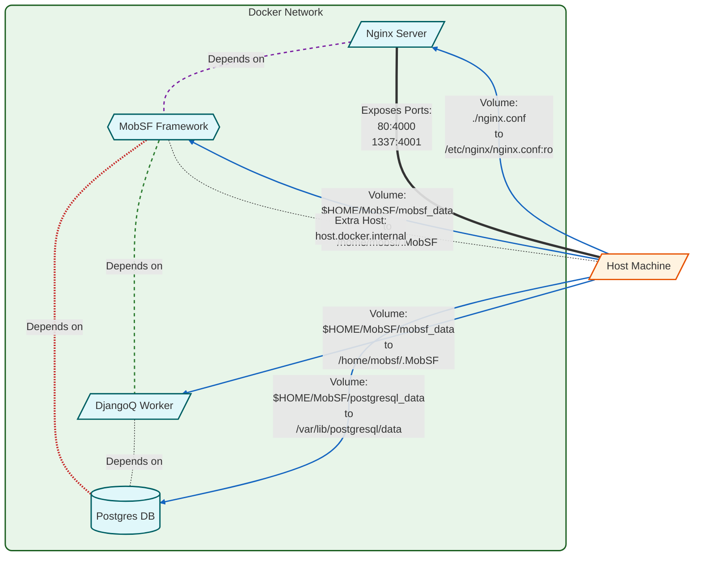

# Docker Options

## Docker
#### Prebuilt Docker image from DockerHub

```bash
docker pull opensecurity/mobile-security-framework-mobsf
docker run -it --rm -p 8000:8000 opensecurity/mobile-security-framework-mobsf:latest
```

#### For persistence

```bash
# On Linux
mkdir <your_local_dir>
sudo chown -R 9901:9901 <your_local_dir>

docker run -it --rm --name mobsf -p 8000:8000 -v <your_local_dir>:/home/mobsf/.MobSF opensecurity/mobile-security-framework-mobsf:latest
```

#### Building Image from Dockerfile

```bash
git clone https://github.com/MobSF/Mobile-Security-Framework-MobSF.git
cd Mobile-Security-Framework-MobSF
docker build -t mobsf .
docker run -it --rm -p 8000:8000 mobsf
```

#### Building Image behind a proxy from Dockerfile

```bash
docker build --build-arg https_proxy="https://${PROXY_IP}:${PROXY_PORT}" --build-arg http_proxy="${PROXY_IP}:${PROXY_PORT}" --build-arg NO_PROXY="127.0.0.1" -t mobsf .
```

Set the environment variable `PROXY_IP` with the value of your proxy ip address and `PROXY_PORT` with the proxy port used.

#### Rebuilding Image from Dockerfile from Scratch

```bash
docker build --no-cache --rm -t mobsf .
```

#### To see the mobsf container logs

```bash
docker logs -f --tail 100 mobsf
```
## Docker Compose
#### For Postgres and Nginx reverse proxy support

```bash
# On Linux
mkdir -p $HOME/MobSF/mobsf_data
sudo chown -R 9901:9901 $HOME/MobSF/mobsf_data

cd docker

# Download the latest images 
docker compose pull

# Launch the services
docker compose up

# or run in the background
docker compose up -d

# See logs from mobsf container
docker compose logs -f mobsf 

# Stop the containers
docker compose down
```

### Architecture



**Docker Compose Configuration for MobSF**

This configuration sets up a multi-container environment for running MobSF with PostgreSQL and Nginx.

Services:

1. postgres
   - Image: PostgreSQL 13 image
   - Purpose: Provides the database backend for MobSF
   - Configuration:
     * Persistent volume for data storage
     * Environment variables for database credentials
     * Connected to mobsf_network

2. nginx
   - Image: Latest Nginx image
   - Purpose: Acts as a reverse proxy and web server
   - Configuration:
     * Exposes ports 80 and 1337
     * Custom Nginx configuration file mounted
     * Depends on mobsf service
     * Connected to mobsf_network

3. mobsf
   - Image: Latest MobSF image
   - Purpose: Runs the Mobile Security Framework application
   - Configuration:
     * Volume mounted for MobSF data persistence at /home/mobsf/.MobSF
     * Environment variables for PostgreSQL connection
     * Depends on postgres service
     * Extra host configuration for Docker host access required for adb connectivity
     * Connected to mobsf_network

4. djangoq
   - Image: Latest MobSF image
   - Purpose: Runs DjangoQ2 to manage asynchronous task queues for MobSF
   - Configuration:
     * Command: Runs qcluster.sh to start DjangoQ2 clusters
     * Volume mounted for MobSF data persistence at /home/mobsf/.MobSF
     * Environment variables for PostgreSQL connection
     * Depends on the postgres service.
     * Connected to mobsf_network.

Network:
   - A custom bridge network 'mobsf_network' is created for inter-service communication

Note: All services are set to restart automatically in case of failures, except DjangoQ, which is configured to restart unless stopped.
